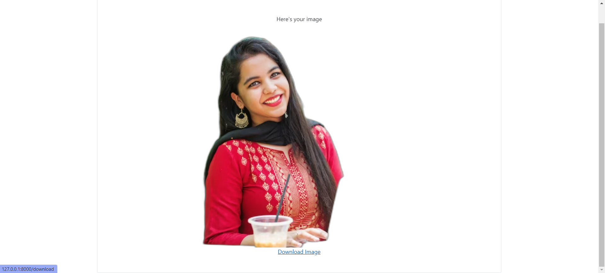

# Image Background Remover

This is a very simple image background remover built using python with the django framework.This tool keeps things simple, allowing you to effortlessly remove backgrounds from images. Built with ease of use in mind, it's a handy solution for quick background removal tasks.

# Output: 
## Main page:

## Preview Page: 

## Output :


# background_remover app :

I've developed a simple yet powerful background remover app using Python's Pillow and the rembg library. The app offers a user-friendly interface with three key functions. The first function directs users to the home page of the website. The second function utilizes the Pillow and rembg libraries to seamlessly remove the background from uploaded images. Finally, the third function enables users to download the processed image in PNG format. Whether you're looking to enhance your images or understand the intricacies of background removal, this app provides a streamlined solution. Explore the capabilities and contribute to the project on GitHub.

```
# views.py
from django.shortcuts import render
from rembg import remove
from PIL import Image
from django.views.decorators.csrf import csrf_protect
import base64
import io
from django.http import HttpResponse
from django.contrib.sessions.models import Session
from django.shortcuts import get_object_or_404
import os
from django.conf import settings
from datetime import datetime

def home(request):
    return render(request, 'home.html')

@csrf_protect
def action(request):
    if request.method == 'POST':
        uploaded_file = request.FILES.get('file')

        if uploaded_file:
            print("Image uploaded succesfully")
            print(f"Image recieved: {uploaded_file}")
            x = Image.open(uploaded_file)
            print("Removing background")
            result = remove(x)
            print("Successful")

            # Save the image in memory for displaying in Result.html
            image_io = io.BytesIO()
            result.save(image_io, format='PNG')
            image_data = base64.b64encode(image_io.getvalue()).decode('utf-8')

            # Generate a unique filename based on timestamp
            timestamp = datetime.now().strftime('%Y%m%d%H%M%S')
            filename = f'convert_{timestamp}.png'

            # Store the image data and filename in the session
            request.session['result_image_data'] = image_data
            request.session['result_filename'] = filename

            return render(request, 'Result.html', {'Result': f'data:image/png;base64,{image_data}', 'filename': filename})

    return render(request, 'Home.html')

def download_image(request):
    # Retrieve image data and filename from the session
    image_data = request.session.get('result_image_data')
    filename = request.session.get('result_filename', 'convert.png')  # Default to 'convert.png' if not provided
    print(f"Downloading image : {filename}")
    print("Process completed succesfully")

    if image_data:
        # Clear the session data after retrieving it
        request.session.pop('result_image_data', None)
        request.session.pop('result_filename', None)

        # Return the image data as a downloadable response
        response = HttpResponse(base64.b64decode(image_data), content_type='image/png')
        response['Content-Disposition'] = f'attachment; filename={filename}'
        return response
    else:
        return HttpResponse("Image data not found in session.")


```

# Rembg Credits:
Credits: https://github.com/danielgatis/rembg

## License:
MIT License

Copyright (c) 2020 Daniel Gatis

Permission is hereby granted, free of charge, to any person obtaining a copy
of this software and associated documentation files (the "Software"), to deal
in the Software without restriction, including without limitation the rights
to use, copy, modify, merge, publish, distribute, sublicense, and/or sell
copies of the Software, and to permit persons to whom the Software is
furnished to do so, subject to the following conditions:

The above copyright notice and this permission notice shall be included in all
copies or substantial portions of the Software.

THE SOFTWARE IS PROVIDED "AS IS", WITHOUT WARRANTY OF ANY KIND, EXPRESS OR
IMPLIED, INCLUDING BUT NOT LIMITED TO THE WARRANTIES OF MERCHANTABILITY,
FITNESS FOR A PARTICULAR PURPOSE AND NONINFRINGEMENT. IN NO EVENT SHALL THE
AUTHORS OR COPYRIGHT HOLDERS BE LIABLE FOR ANY CLAIM, DAMAGES OR OTHER
LIABILITY, WHETHER IN AN ACTION OF CONTRACT, TORT OR OTHERWISE, ARISING FROM,
OUT OF OR IN CONNECTION WITH THE SOFTWARE OR THE USE OR OTHER DEALINGS IN THE
SOFTWARE.

# Image credits :

https://www.pexels.com/photo/photo-of-a-man-listening-music-on-his-phone-846741/

https://www.pexels.com/photo/woman-wearing-black-jacket-3768882/
